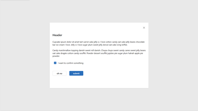
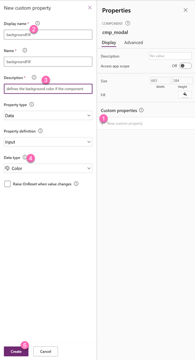

# Our component: Modal window

## 📝 Mainquest

Our modal window shall

- shall validate if the trip duration does not exceed a certain amount if days (for example 7)
- inform users of obvious errors (end date before start date)



//TODO Luise change size to by App.Size and blur out background

Before we start, go to **Setting** and then **Updates** and turn on **Modern controls and themes**


To keep things easier in the workshop, we will build this component in the app.

* On a new screen in the tree view, select the **Components** tab


## Component Basics

Let's first take care of name, size and background of the component

### Name

* Select **+New component**
* Select  **...**
* Select **Rename**
* Rename to `cmp_modal`

### Size

We want the size of the component to adjust to our screen, therefore can't give it absolute values.

Instead, we do:

* **Width**: `App.Width/2`
* **Height**: `App.Height/2`

### Background

For the **Fill** property, we will make it as flexible as possible. We can achieve this by giving the component a custom property `backgroundFill`. Later on in the app, we can then assign a value to this custom property. This means, that for every app, the same modal can be used but will adhere to color schemes of different apps. 

* Select **New custom property**
* Fill in the fields for Display Name `backgroundFill` and Description and for **Data type** select `Color`
* Select **Create**



Now select **backgroundFill** and define a default value


You can use any value, but we'd recommend to not use white so that you can spot a difference 💡

Now we need to assign the `backgroundFill` to the **Fill** of our component. All custom properties of this component are accessible via dot notation: 


Let's try this out in our app:

* Select **Screens** again in the Tree view
* Select **Insert**


you should see something like this: A square, half of the size of your screen in grey. Now select the component in the Tree view and in the **Custom properties** on the right hand side, select the colorpicker and change the color.


This way you can reuse the component even if the colors (or other values of the component) change across apps.

Now that we know about custom (input) properties, let's use this knowledge to build the modal. Change back to the component and insert


## Add controls to the component

* a horizontal container
  * **X**: `0`
  * **Y**: `0`
  * **Width**: `Parent.Width`
  * **Height**: `Parent.Height`
  * **Gap**: `20`
  * **Padding** `20` (Top, Right, Bottom, Left)

* Insert a **Button** control
  * rename to `btn_dismiss`
  * for the **Icon** select `Dismiss`
  * Change the **Layout** to be  `Icon Only` (Icons themselves without being a button are not interactive 💡)
  * Set the **Text** to `Dismiss`
  * Set the **AccessibleLabel** to `Self.Text` (that is usually a good practice, because with Buttons, Text commonly changes throughout a project, this way the AccessibleLabel represents what the button says)
  * Set the **Width** to `24`
  * Set the **Type** to `Subtle`
  * Set the **Align in container** to `End`

  
We will later assign functionality to this button.

* Insert a new **Text** control in the container
* Rename it to be `lbl_header`
* Select the component again and create a new custom property for the Text of this textlabel
* Like before, fill in the form, make sure you select the right **Data type** (in this case it should stay with the default value `Text`) and select **Create**


Now select the **headerText** property and assign a default value like `Confirmation` or even `Lorem Ipsum` by selecting **Screens** again in the Tree view

We will now assign the `headerText` to the **Text** of the label:


Now we can assign new values to our custom property in each and every single app we use this component.

### 🦄 Side Quest

*only do the side quest if you have time to do so*

Think about other custom input properties you could create and assign and which default value you'd set. For example, Font, Font size, Font Weight. Feel free to create these and more!

### Add even more controls

We now want to add even more controls:

* A text for the body
* A Checkbox to confirm something

#### Label for the body

Insert the label, change its name to `lbl_body` and create a custom property in the component. Then again assign a default value to the property


#### Checkmark

Insert a checkbox, rename it to `chk_confirm`, create a custom property for the text next to the checkbox. Then again assign a default value to the property. After we handled the text next to the checkbox, lets tackle the functionality of the checkbox. What we want is, that when the user confirms something by checking the box, we set a variable or similar. To do that, we need to create another custom property, but unlike the last time, we can't do this with a data input property, but with an  **Event** property type.

We will need to have one property for an onCheck event and another one for the onUncheck event. 


After creating the property, we will now assign this event to the **Oncheck** (capital O, this means its a built in property) property of our checkbox


In our component instance (change to **Screens** again) you can now assign a variable like `isChecked` to the **onUncheck** and **onCheck** properties of the component:


Accordlingly, for the **onCheck** property, you'd do `Set(isChecked, true)`

Now, whenever we have a check or uncheck event in the component instance, we can use this value (`true` or `false`) for further advancements, for example: toggle the **Displaymode** property of a button based on that value.

Let's do this!

#### 2 buttons: oh no and submit

We now want two buttons, one to go back and close the modal, the other one to submit the data after confirming.

* Place both buttons into a horizontal container with a gap of `20`

##### submit button

* change the **Text** property to `submit`
* set the **Displaymode** to `If(chk_confirm.Checked, DisplayMode.Edit, DisplayMode.Disabled)` - this means that if the checkbox isn't checked, you can't select the button
* Create a custom property of type **Event** for what shall happen when the user wants to create the trip. Call it `onSubmit`. We don't need to specify the return data type
* In the **onSelect** property of the `btn_submit`, put `cmp_modal.onSubmit()` - if you wonder what are the `()` for - we could pass in parameters in other usecases, here its not neccessary
* Now in your component instance (change to **Screens**) select the **onSubmit** property and set it to 

```

ClearCollect(
    colTrips,
    {
        id: GUID(),
        name: "Color CLoud Hamburg",
        start: Today(),
        end: Today() + 1
    }
);

```

//TODO change to reference control names for name, start and end date from Robin

What we also want is then to make the modal disappear. We do this by toggling a variable on **Visible** property of the component.

Extend the code above for the **onSubmit** property by this line:

`Set(isShowModal, false)`

In the component instance (change to **Screens** again), select the component's **Visible** property and change it to `isShowModal`

//TODO Robin show modal with `Set(isShowModal, true)`in the app under a condition... for example end date fore start date or trip durateion > 7 days. In both cases, align the texts of the modal with the custom properties. 


##### Oh no button


The oh no button shall close the modal. THis means, we need to create *another* **Event** type property in the component `onClose`.

* set the **OnSelect** to `cmp_modal.onClose`
* Change back to **Screens**
* In the component instance, set the **onClose** property to `Set(isShowModal, false)` (remember, this makes our modal disappear)

##### Dismiss icon button

Remember our dismiss icon (which actually is a button?) We will assign the same event to it:

* Change back to **Components** and select the `btn_dismiss`
* In the **OnSelect**, put `cmp_modal.onClose()`

This as well will call the event that will then set the `isShowModal` variable to false.
