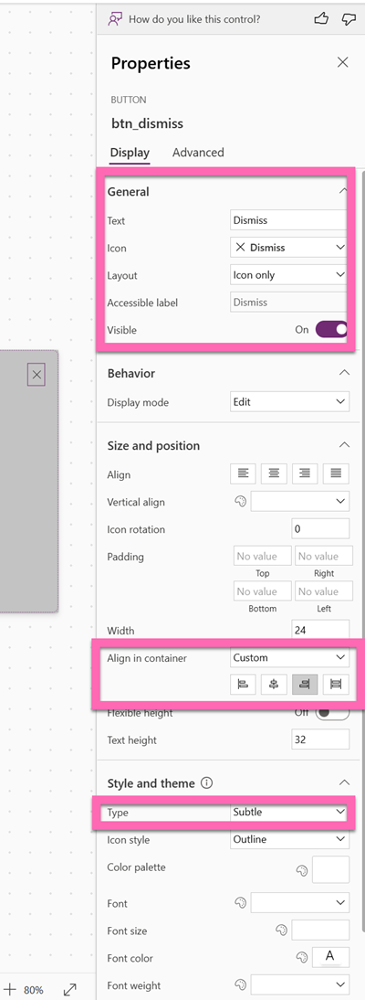
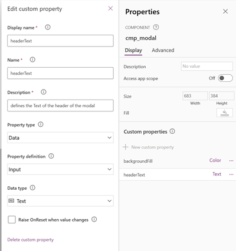

# Our component: Modal window

## 📝 Mainquest

Our modal window shall

- be responsive and work on different screen sizes
- shall validate if the trip duration does not exceed a certain amount if days (for example 7)
- inform users of obvious errors (end date before start date)

Before we start, go to **Setting** and then **Updates** and turn on **Modern controls and themes**

To keep things easier in the workshop, we will build this component in the app.

* On a new screen in the tree view, select the **Components** tab

## Component Basics

Let's first take care of name, size and background of the component

### Name

* Select **+New component**
* Select  **...**
* Select **Rename**
* Rename to `cmp_modal`

### Size

We want the size of the component to adjust to our screen, therefore can't give it absolute values.

Instead, we do:

* **Width**: `App.Width/2`
* **Height**: `App.Height/2`

### Background

For the **Fill** property, we will make it as flexible as possible. We can achieve this by giving the component a custom property `backgroundFill`. Later on in the app, we can then assign a value to this custom property. This means, that for every app, the same modal can be used but will adhere to color schemes of different apps. 

* Select **New custom property**
* Fill in the fields for Display Name `backgroundFill` and Description and for **Data type** select `Color`
* Select **Create**

Now select **backgroundFill** and define a default value

You can use any value, but we'd recommend to not use white so that you can spot a difference 💡

Now we need to assign the `backgroundFill` to the **Fill** of our component. All custom properties of this component are accessible via dot notation: 

Let's try this out in our app:

* Select **Screens** again in the Tree view
* Select **Insert**

you should see something like this: A square, half of the size of your screen in grey. Now select the component in the Tree view and in the **Custom properties** on the right hand side, select the colorpicker and change the color.

This way you can reuse the component even if the colors (or other values of the component) change across apps.

Now that we know about custom (input) properties, let's use this knowledge to build the modal. Change back to the component and insert

## Add controls to the component

* a horizontal container
  * **X**: `0`
  * **Y**: `0`
  * **Width**: `Parent.Width`
  * **Height**: `Parent.Height`
  * **Gap**: `20`
  * **Padding** `20` (Top, Right, Bottom, Left)

* Insert a **Button** control
  * rename to `btn_dismiss`
  * for the **Icon** select `Dismiss`
  * Change the **Layout** to be  `Icon Only` (Icons themselves without being a button are not interactive 💡)
  * Set the **Text** to `Dismiss`
  * Set the **AccessibleLabel** to `Self.Text` (that is usually a good practice, because with Buttons, Text commonly changes throughout a project, this way the AccessibleLabel represents what the button says)
  * Set the **Width** to `24`
  * Set the **Type** to `Subtle`
  * Set the **Align in container** to `End`

  
We will later assign functionality to this button.

* Insert a new **Text** control in the container
* Rename it to be `lbl_header`
* Select the component again and create a new custom property for the Text of this textlabel
* Like before, fill in the form, make sure you select the right **Data type** (in this case it should stay with the default value `Text`) and select **Create**

Now select the **headerText** property and assign a default value like `Confirmation` or even `Lorem Ipsum` by selecting **Screens** again in the Tree view

We will now assign the `headerText` to the **Text** of the label:

Now we can assign new values to our custom property in each and every single app we use this component.

### 🦄 Side Quest

Think about other custom input properties you could create and assign and which default value you'd set. For example, Font, Font size, Font Weight. Feel free to create these and more! 

