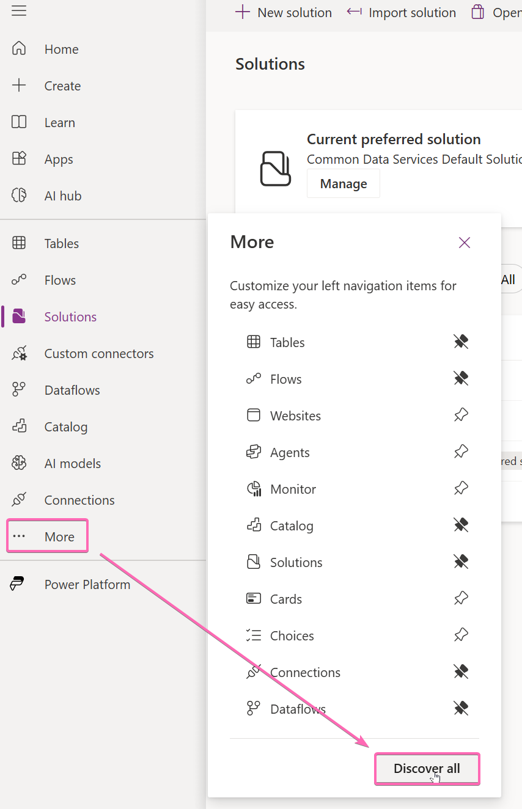

# Use AI Prompts to extract data from a receipt

## 📝 Mainquest

Bringing GenAI to Canvas Apps and Power Automate has never been easier! In this lab we will create a quick AI Prompt, that will help us extract structured information in JSON format.

### Create a prompt

Navigate to [https://make.powerapps.com](https://make.powerapps.com).

The feature is a little bit hidden, you will find it und `More`->`Discover all`.



Scroll all the way down an select `Prompts`. Pin this feature, because you will want to use this all the time from now on 😉!

Click on `Create your own prompt` and rename it to `Analyze receipt`.

Change the instructions to the following text:
```
A user uploads a receipt
Extract the date in the following "2020-01-31", the amount as a number, the currency and the company

This is a picture of the receipt
```


Now we will create a dynamic input for the receipt file.

Create a new line in the instructions and type a **/**. Select **Image or Document**


Rename it to `receipt` and Upload a Sample File. You can either use one of your old travel receipts or download a sample from the [demodata](demodata).


Set the **Output Format** to **JSON**


Hit **Test** and wait for a few seconds.

A response in this JSON format should appear:


Now we can save the prompt and use it in Power Apps.

Create an empty Canvas App and add **Analyze receipt** as a Datasource.


Use an **Add picture** button to upload the image. We can now call our prompt from the **OnChange**-property and write it to a variable. We can directly save the structured ouput like this:

```
Set(gblReceiptData, 'Analyze receipt'.Predict(Self.Media).StructuredOutput);
```

You can now try to build a small custom form, that writes the extracted values to input controls, but lets the user change the values:


You can access the structured data like this:
```
gblReceiptData.company
```

If you want to take a shortcut, you can copy the yaml-code [with AI Builder](solution/InputForm.yaml) or an alternative that will generate the same format with mock data [without the AI Builder](solution/InputFormWithoutPrompt.yaml).

For an even more detailed explanation of how to build the canvas app, please see the [runthrough](runthrough-demo1.md)
