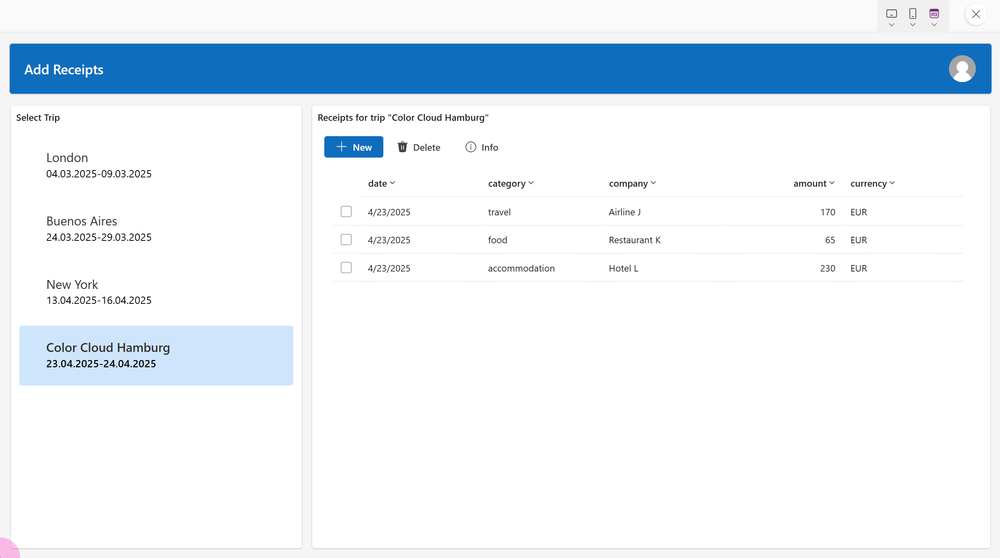
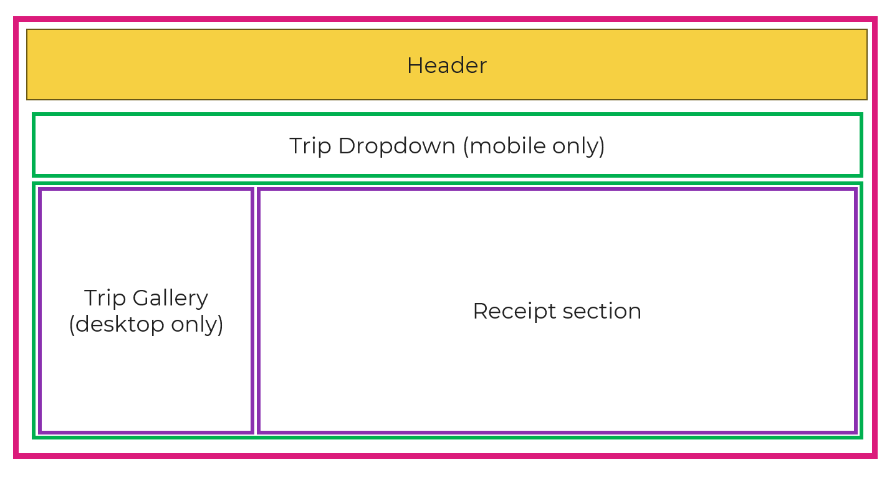
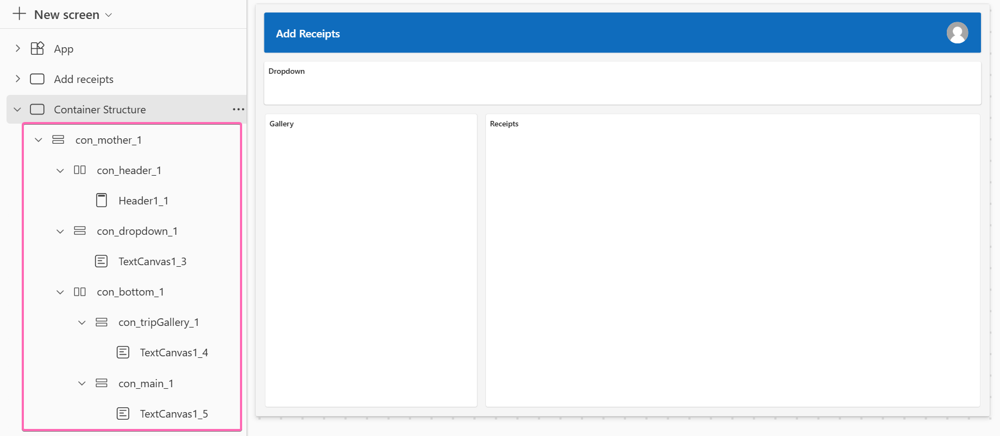
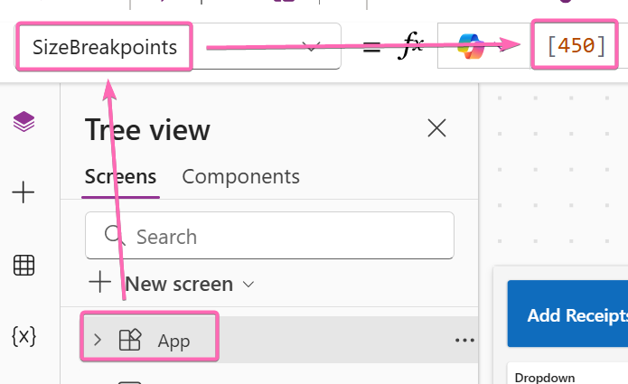
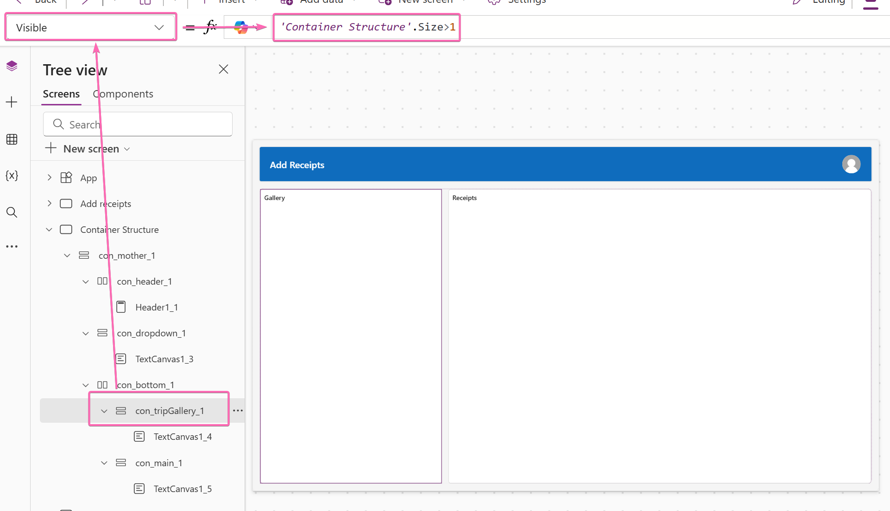
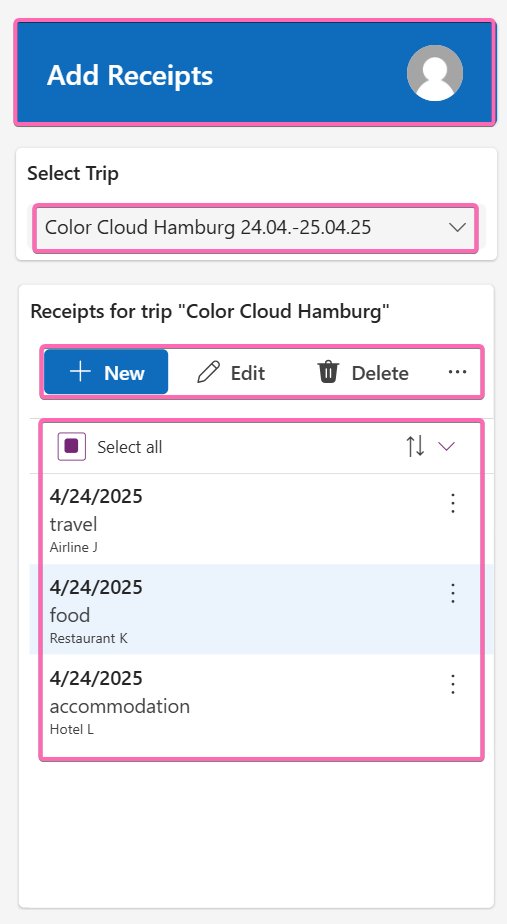
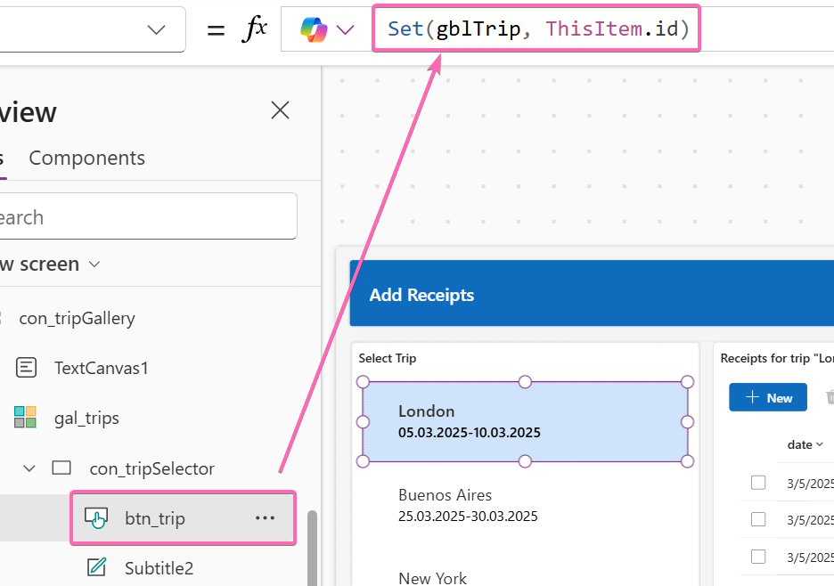
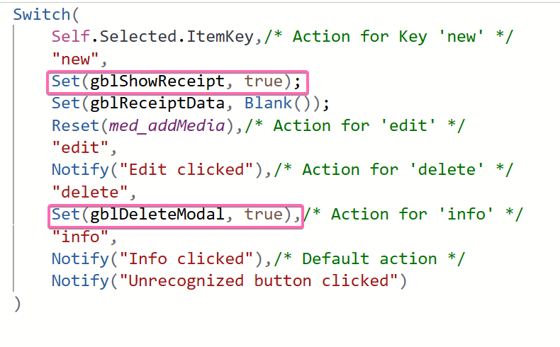
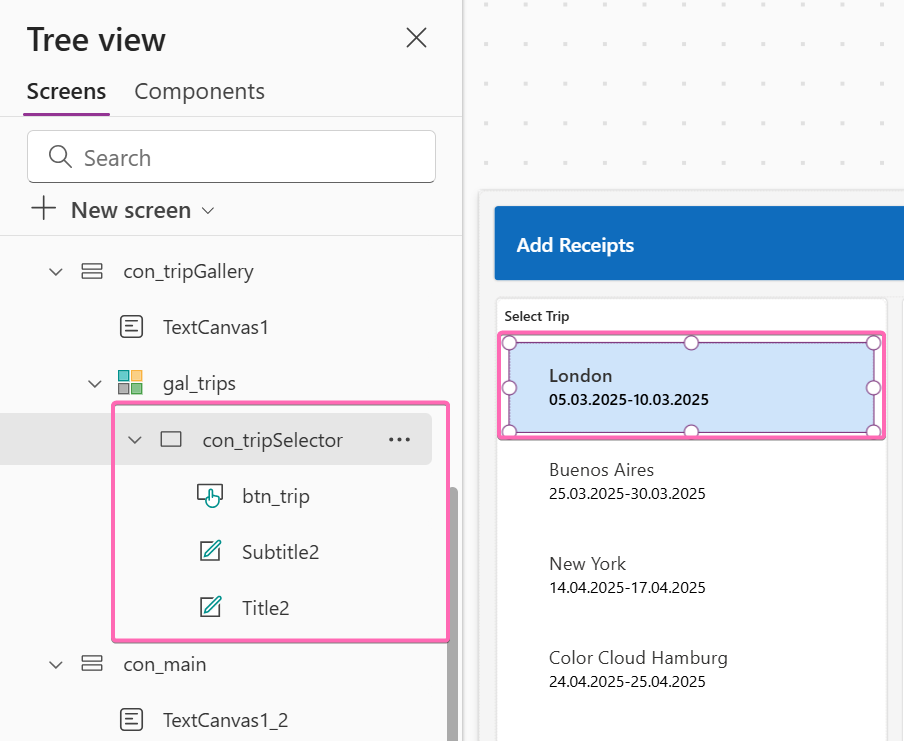

# Our component: Modal window

## 📝 Mainquest

We want to create an app that works on phone AND desktop while reusing most of the UI for both systems. We will learn how to use containers as well as the **Size** property to achieve this.

### Demo

This is a quick demo of both systems.



As we can see the header, the modal from lab 1 as well as the whole receipt section is reused. For selecting a trip we switch between a gallery on the left, to a dropdown on top.

### Demo Data

Let's start with some demo data to play around for the trips and receipts. Optimally we would store them in Dataverse, but for this workshop we won't focus on that part. We will just create some local data in the **OnStart** property of the App:

```
ClearCollect(
    colTrips,
    {id: GUID(), name: "London", start: Today()-50, end: Today()-45},
    {id: GUID(), name: "Buenos Aires", start: Today()-30, end: Today()-25},
    {id: GUID(), name: "New York", start: Today()-10, end: Today()-7},
    {id: GUID(), name: "EPPC25 Vienna", start: Today(), end: Today()+1}
);

ClearCollect(
    colReceipts,
    // Trip 1: London
    {
        date: Today()-50,
        amount: 120.00,
        currency: "GBP",
        category: "travel",
        tripid: LookUp(colTrips, name = "London").id,
        company: "Airline Co."
    },
    {
        date: Today()-50,
        amount: 45.50,
        currency: "GBP",
        category: "food",
        tripid: LookUp(colTrips, name = "London").id,
        company: "Restaurant A"
    },
    {
        date: Today()-50,
        amount: 200.75,
        currency: "GBP",
        category: "accommodation",
        tripid: LookUp(colTrips, name = "London").id,
        company: "Hotel B"
    },
    {
        date: Today()-50,
        amount: 30.00,
        currency: "GBP",
        category: "miscellaneous",
        tripid: LookUp(colTrips, name = "London").id,
        company: "Store C"
    },
    // Trip 2: Buenos Aires
    {
        date: Today()-29,
        amount: 150.00,
        currency: "ARS",
        category: "travel",
        tripid: LookUp(colTrips, name = "Buenos Aires").id,
        company: "Train Co."
    },
    {
        date: Today()-29,
        amount: 60.00,
        currency: "ARS",
        category: "food",
        tripid: LookUp(colTrips, name = "Buenos Aires").id,
        company: "Cafe D"
    },
    {
        date: Today()-29,
        amount: 220.00,
        currency: "ARS",
        category: "accommodation",
        tripid: LookUp(colTrips, name = "Buenos Aires").id,
        company: "Hotel E"
    },
    {
        date: Today()-29,
        amount: 40.00,
        currency: "ARS",
        category: "miscellaneous",
        tripid: LookUp(colTrips, name = "Buenos Aires").id,
        company: "Store F"
    },
    // Trip 3: New York
    {
        date: Today()-9,
        amount: 180.00,
        currency: "USD",
        category: "travel",
        tripid: LookUp(colTrips, name = "New York").id,
        company: "Bus Co."
    },
    {
        date: Today()-9,
        amount: 55.00,
        currency: "USD",
        category: "food",
        tripid: LookUp(colTrips, name = "New York").id,
        company: "Restaurant G"
    },
    {
        date: Today()-9,
        amount: 250.00,
        currency: "USD",
        category: "accommodation",
        tripid: LookUp(colTrips, name = "New York").id,
        company: "Hotel H"
    },
    {
        date: Today()-9,
        amount: 35.00,
        currency: "USD",
        category: "miscellaneous",
        tripid: LookUp(colTrips, name = "New York").id,
        company: "Store I"
    },
    // Trip 4: EPPC25 Vienna
    {
        date: Today(),
        amount: 170.00,
        currency: "EUR",
        category: "travel",
        tripid: LookUp(colTrips, name = "EPPC25 Vienna").id,
        company: "Airline J"
    },
    {
        date: Today(),
        amount: 65.00,
        currency: "EUR",
        category: "food",
        tripid: LookUp(colTrips, name = "EPPC25 Vienna").id,
        company: "Restaurant K"
    },
    {
        date: Today(),
        amount: 230.00,
        currency: "EUR",
        category: "accommodation",
        tripid: LookUp(colTrips, name = "EPPC25 Vienna").id,
        company: "Hotel L"
    }
);
```

You can now use **colTrips** and **colReceipts** as demo data and patch new receipts into that collection.


### Container

Let's make a first sketch how we will set up the screen.



We can already see, that we will need a lot of containers and will nest up to 3 layers of containers at one point. When we create containers, we work from the outside to the inside.

For every container we need to determine wether it will be a horizontal or a vertical container. We have to see how the containers in the next layer are stacked to do that.

* the outer container has to be vertical, because the header and the green containers are stacked vertically.
* the lower green container has to be horizontal, because the purple containers are stacked horizontally
* the purple ones will be vertical containers (like most containers that contain the actual content)

Make sure to use the correct fill colors and drop shadows in the respective containers.

You should end up with a screen that looks like this:



### Responsive depending on Screen Size

We will be using the Screen Size properties together with the Breakpoints property to switch the look of the app depending on the device that is used.

We want to display the dropdown, when the Screen Width is smaller than 450 pixels and the gallery on the left, when it is larger than that.

In the tree view click on **App** and change the **SizeBreakpoints** property to `[450]`. This means, that we will only have one breakpoint at 450 pixels.



We can now use the simple formulas `Screenname.Size = 1` and `Screenname.Size > 1` to determine which screen size the current user has.

Let's apply them to the respective **Visible** properties of the 2 containers that we want to switch depending on the size.



This is already it! We have succesfully created a responsive screen design 🎉

You can also copy&paste the yaml-code from [this file](solution/ScreenLayout.yaml) which contains the whole code up to this point.

### Fill the screen

Now bring everything together and fill the screen to your liking and add the modal from lab 1.

Here are some hints and key points.

If you want to take a peak at the complete solution, you can download and install it from [this file](solution/AIAppWorkshopDemo_1_0_0_1.zip).

#### Modern Controls



#### Load the selected trip into a variable



#### Make modals appear and disappear



#### Dynamic Buttons in Toolbar Control

```
Filter(Table(
    {
        ItemKey: "new",
        ItemDisplayName: "New",
        ItemIconName: "Add",
        ItemAppearance: "Primary",
        ItemIconStyle: "Regular",
        ItemTooltip: "Add new item",
        visible: true
    },
    
    {
        ItemKey: "edit",
        ItemDisplayName: "Edit",
        ItemIconName: "Edit",
        ItemAppearance: "Subtle",
        ItemIconStyle: "Regular",
        visible: CountRows(tbl_receipts.SelectedItems)=1
    },
    {
        ItemKey: "delete",
        ItemDisplayName: "Delete",
        ItemIconName: "Delete",
        ItemDisabled: CountRows(tbl_receipts.SelectedItems)=0,
        ItemAppearance: "Subtle",
        ItemIconStyle: "Filled",
        visible: true
    },
    {
        ItemKey: "info",
        ItemDisplayName: "Info",
        ItemIconName: "Info",
        ItemAppearance: "Subtle",
        ItemIconStyle: "Regular",
        visible: true
    }
), visible)
```

#### Normal Containers

